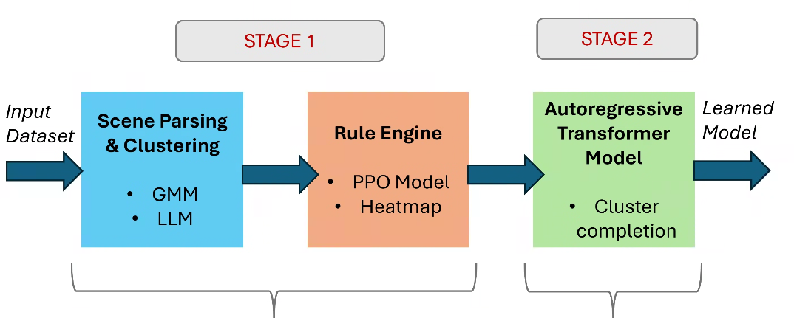

# SAIFRaP

### Space-Aware Indoor Furniture Recommendation and Placement using Agentic AI

This paper proposes an agentic artificial intelligence (AI) driven framework for automated furniture recommendation and placement in indoor settings. Unlike existing approaches that treat object selection and spatial arrangement as separate problems, our method unifies space-aware and object-aware synthesis through a two-stage cluster-oriented pipeline. Given a room's floor plan, the first stage uses a proximal policy optimization (PPO) agent integrated with a rule-penalty engine to identify optimal placement regions (sweetspots'') for furniture clusters, guided by learned spatial priors and semantic relationships extracted from populated scene datasets. The second stage utilizes an autoregressive transformer to complete scene synthesis by populating each identified cluster with contextually appropriate furniture arrangements. Our agentic AI framework shows autonomous reasoning capabilities through interpretable decision-making processes, contrasting with traditional black-box approaches. The method incorporates semantic-spatial consistency scoring, object occurrence heatmaps, and functional relationship modeling to ensure realistic and aesthetically pleasing layouts. We performed comprehensive qualitative and quantitative evaluations against recent methods, and our method delivers competitive performance while providing enhanced spatial reasoning and layout utilization. Our method addresses the key challenge of generating functional and semantically meaningful room settings, key to many intelligent environment applications in metaverse, extended reality, and personalized interior design systems.



------


## 📝 Overview

- **Stage 1 — Cluster Estimation**
  - Leverages **layout  and object attributes** and **semantic relationships** to extract the cluster attributes.
- **Stage 2 — Root Object Estimation**
  - A **Proximal Policy Optimization (PPO)** agent integrated with a **rule–penalty engine** identifies optimal placement regions ("sweet spots") for root object.
- **Stage 2 — Scene Completion**
  - An **autoregressive transformer** populates each cluster with contextually appropriate furniture arrangements.

------


## 🚀 Installation

```bash
git clone git@github.com:graphics-research-group/SAIFRaP.git
cd SAIFRaP
pip install -r requirements.txt
```

------


## ▶️ Usage

### 1. Cluster Estimation

Run the provided notebook to identify clusters.

```bash
# Launch the cluster estimation notebook (Jupyter, Colab, or JupyterLab)
run cluster.ipynb
```

### 2. Root Object Estimation

Apply the rule-based engine for a specific room type.

```bash
# Example usage per room type (replace <room_type> with bedroom, livingroom, etc.)
run rule_engine_<room_type>.ipynb
```

### 3. Scene Completion

Complete the scene by populating clusters with furniture using the autoregressive transformer.

```bash
python auto_completion.py \
    path_to_config_yaml \
    path_to_output_dir \
    path_to_3d_future_pickled_data \
    path_to_floor_plan_texture_images \
    path_to_weight_file \
    fixed_object_labels \
    fixed_object_translation
```


------

## 📚 Citation

If you use this code in your research, please cite:

```
Coming soon
```

------


## 🙏 Acknowledgements

We build upon and reuse components from the ATISS project. We thank the ATISS authors for making their implementation available.

```
We use code from ATISS in our implementation and would like to thank the authors for their excellent work and for making their code publicly available.
```

------


## 🛠️ Project Structure

```
SAIFRaP/
├─ assets/                  # pipeline diagram
├─ preprocessing/           # cluster estimation script
├─ rule_engine/             # rule_engine_*.ipynb files
├─ scene_completion/        # scene completion script 
├─ utils/                   # utility and helper functions
├─ README.md                
└─ requirements.txt
```

------


## 📬 Contact

For questions, issues, or contributions, open an issue or pull request on the repository, or contact gauravr@iiitd.ac.in .

------

